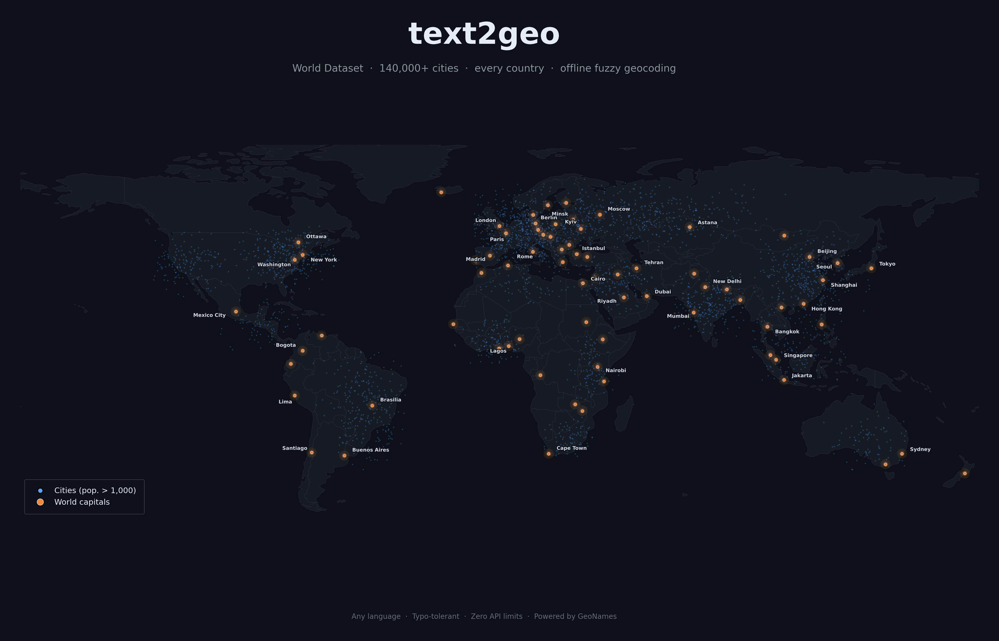
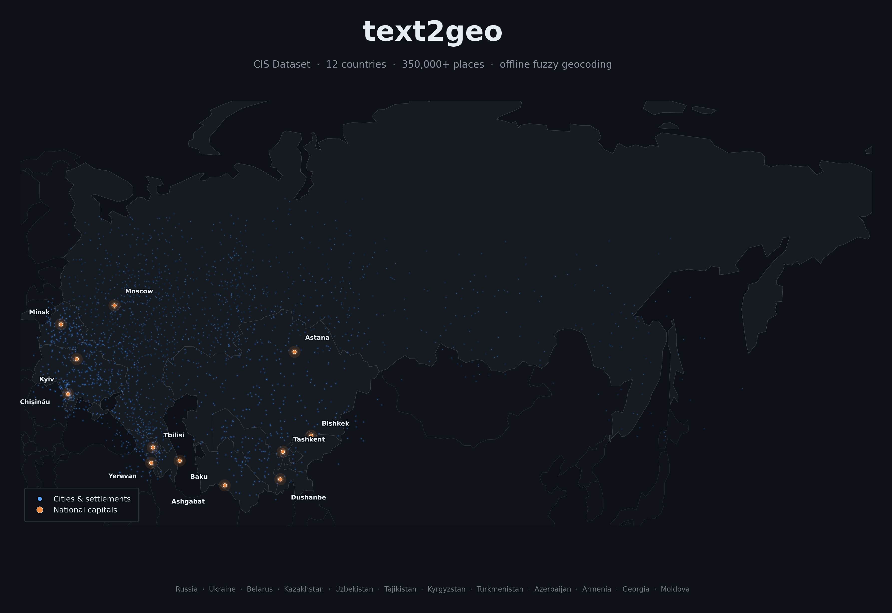
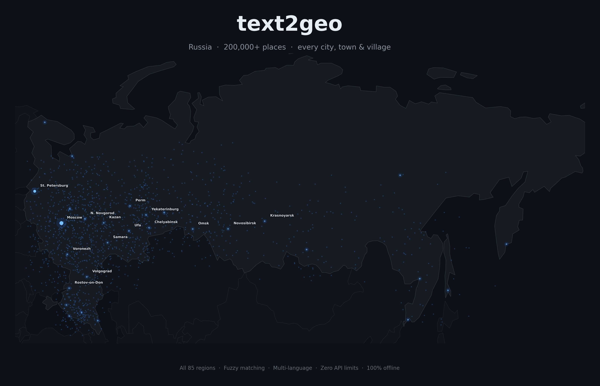

<p align="center">
  <h1 align="center">🌍 text2geo</h1>
  <p align="center">
    <strong>Offline fuzzy geocoder — convert place names to coordinates with zero API limits.</strong>
  </p>
  <p align="center">
    <a href="https://www.python.org/downloads/"></a>
    <a href="LICENSE"></a>
    <a href="https://www.geonames.org/"></a>
  </p>
</p>

---

**text2geo** turns messy, misspelled place names into precise latitude/longitude coordinates — entirely offline, with no API keys, no rate limits, and no costs. Powered by [GeoNames](https://www.geonames.org/) data and [rapidfuzz](https://github.com/rapidfuzz/RapidFuzz) for typo-tolerant matching.

## Features

- **Offline & unlimited** — no API keys, no rate limits, no internet needed after initial data download
- **Fuzzy matching** — handles typos, transliterations, and alternate spellings (`"Масква"` → Moscow)
- **Multi-language** — works with names in any language (Russian, English, Ukrainian, etc.)
- **Three datasets** — Russia-only, CIS/former USSR, or worldwide coverage
- **Batch geocoding** — process thousands of names in seconds
- **Zero config** — auto-downloads data on first use

## Coverage

<p align="center">
  
</p>

<p align="center">
  
</p>

<p align="center">
  
</p>

## Installation

```bash
pip install text2geo
```

Or install from source:

```bash
git clone https://github.com/charonviz/text2geo.git
cd text2geo
pip install -e .
```

## Quick Start

```python
from text2geo import Geocoder

# Initialize (auto-downloads CIS dataset on first run)
geo = Geocoder(dataset="cis")

# Basic geocoding
geo.geocode("Москва")
# {'name': 'Moscow', 'lat': 55.75222, 'lon': 37.61556, 'country': 'RU', 'population': 10381222, 'score': 100}

# Works with typos
geo.geocode("Санкт Петирбург")
# {'name': 'Saint Petersburg', 'lat': 59.93863, 'lon': 30.31413, 'score': 85, ...}

# Filter by country
geo.geocode("Одесса", country="UA")

# Multiple results
geo.geocode("Москва", top_n=3)

# Batch mode
geo.geocode_batch(["Киев", "Минск", "Алматы", "Тбилиси"])
```

## Datasets

| Dataset | Coverage | Places | Size |
|---------|----------|--------|------|
| `ru` | Russia only | ~200,000 | ~30 MB |
| `cis` | CIS + former USSR (12 countries) | ~350,000 | ~60 MB |
| `world` | All cities worldwide (pop. > 1,000) | ~140,000 | ~50 MB |

### CIS dataset includes:
🇷🇺 Russia · 🇺🇦 Ukraine · 🇧🇾 Belarus · 🇰🇿 Kazakhstan · 🇺🇿 Uzbekistan · 🇹🇯 Tajikistan · 🇰🇬 Kyrgyzstan · 🇹🇲 Turkmenistan · 🇦🇿 Azerbaijan · 🇦🇲 Armenia · 🇬🇪 Georgia · 🇲🇩 Moldova

### Download data

Data is auto-downloaded on first use. To download manually:

```python
import text2geo
text2geo.download("cis")    # CIS countries
text2geo.download("ru")     # Russia only
text2geo.download("world")  # Worldwide
```

Or via CLI:

```bash
python -m text2geo download cis
python -m text2geo download world
```

Data is stored in `~/.text2geo/data/` by default.

## API Reference

### `Geocoder(dataset, data_dir, auto_download, csv_path)`

| Parameter | Type | Default | Description |
|-----------|------|---------|-------------|
| `dataset` | `str` | `"cis"` | Dataset to use: `"ru"`, `"cis"`, or `"world"` |
| `data_dir` | `str \| None` | `None` | Custom data directory (default: `~/.text2geo/data`) |
| `auto_download` | `bool` | `True` | Auto-download dataset if missing |
| `csv_path` | `str \| None` | `None` | Direct path to a custom CSV file |

### `geocoder.geocode(query, country, threshold, top_n)`

| Parameter | Type | Default | Description |
|-----------|------|---------|-------------|
| `query` | `str` | — | Place name in any language |
| `country` | `str \| None` | `None` | ISO 3166-1 alpha-2 filter (e.g. `"RU"`, `"UA"`) |
| `threshold` | `int` | `75` | Minimum fuzzy score (0–100) |
| `top_n` | `int` | `1` | Number of results (1 = dict, >1 = list) |

**Returns:** `dict` with `geonameid`, `name`, `lat`, `lon`, `country`, `population`, `score` — or `None`.

### `geocoder.geocode_batch(queries, country, threshold)`

Same as `geocode` but accepts a list of strings. Returns a list of result dicts. Failed lookups include `"error": "not found"`.

## CLI Usage

```bash
# Download data
python -m text2geo download cis

# Geocode from terminal
python -m text2geo geocode "Москва"
python -m text2geo geocode "Almaty" --dataset world

# Check dataset status
python -m text2geo info
```

## Use Your Own CSV

You can bring your own data as long as the CSV has these columns: `geonameid`, `name`, `asciiname`, `alternatenames`, `latitude`, `longitude`, `country_code`, `population`.

```python
geo = Geocoder(csv_path="/path/to/my_data.csv")
geo.geocode("Some Place")
```

## How It Works

1. On first use, text2geo downloads GeoNames data dumps and stores them as a single CSV.
2. At init, it builds an in-memory index mapping every known name (including alternate/localized names) to row indices.
3. `geocode()` first tries an exact lookup against this index. If no match, it falls back to fuzzy matching via rapidfuzz's `WRatio` scorer.
4. Results are ranked by match score first, then by population (so "Moscow, Russia" beats "Moscow, Idaho").

## Performance

Approximate benchmarks on a modern laptop:

| Operation | Time |
|-----------|------|
| Index build (CIS, ~350K places) | ~15 seconds |
| Exact match lookup | < 1 ms |
| Fuzzy match lookup | ~5-20 ms |
| Batch of 1,000 names | ~10-30 seconds |

## Data Attribution

Place data is sourced from [GeoNames](https://www.geonames.org/) and is licensed under [Creative Commons Attribution 4.0](https://creativecommons.org/licenses/by/4.0/).

## License

MIT — see [LICENSE](LICENSE).
